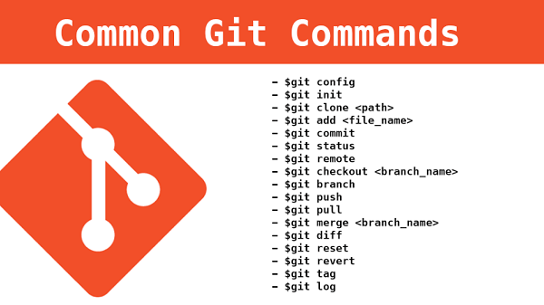
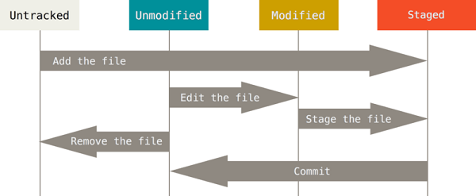
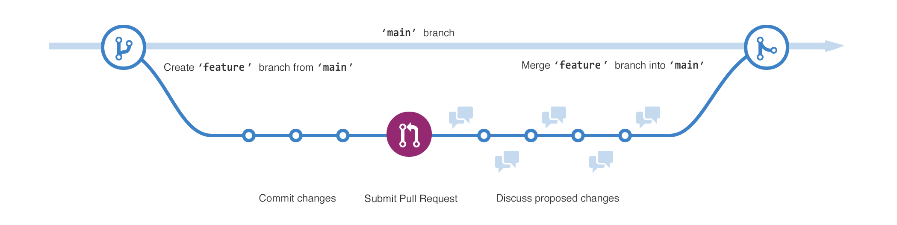
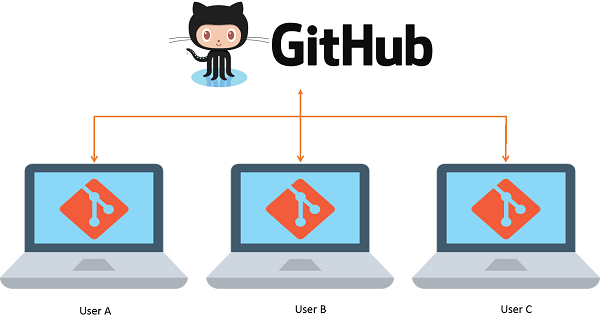

# Git基础知识

[Git](https://git-scm.com/downloads)是Linux发明者Linus开发的一款新时代的版本控制系统，应用广泛。

[](https://git-scm.com/book/zh/v2)

[Git的下载与安装](https://git-scm.com/book/zh/v2/%E8%B5%B7%E6%AD%A5-%E5%AE%89%E8%A3%85-Git)

## Git与版本控制

版本控制是一种记录一个或若干文件内容变化，以便将来查阅特定版本修订情况的系统。

版本控制系统可以分为：
- 本地版本控制系统
- 集中化版本控制系统(CVCS)
- 分布式版本控制系统(DVCS)

Git与其他版本控制系统的区别在于：
- Git直接记录文件快照，而非文件差异比较。<br><br>
- 绝大多数Git操作都只需要访问本地文件和资源，一般不需要来自网络上其它计算机的信息。
- Git中所有的数据在存储前都用SHA-1散列机制计算校验和，然后以校验和来引用。
- Git一般只添加数据，几乎不会执行任何可能导致文件不可恢复的操作。

## Git项目结构

Git项目主要分为：
- 工作区：工作区是对项目的某个版本独立提取出来的内容。这些从Git仓库的压缩数据库中提取出来的文件，放在磁盘上供你使用或修改。
- 暂存区：暂存区是一个文件，保存了下次将要提交的文件列表信息，一般在Git仓库目录中，其本质是一个索引。
- Git仓库：.git目录是Git用来保存项目的元数据和对象数据库的地方。这是Git中最重要的部分，从其它计算机克隆仓库时，复制的就是这里的数据。

## Git文件状态

Git文件的状态主要分为：
- 未追踪(untracked)：基于最近一次commit未修改文件的一种初始态。
- 未修改(unmodified)：基于最近一次commit已有文件改动，但未通过add子命令track这些改动。
- 已修改(modified)：基于最近一次commit已有文件改动，改动已经track但还没保存到数据库中。
- 已暂存(staged)：对一个已修改文件的当前版本做了标记，使之包含在下次提交的快照中。
- 已提交(committed)：文件修改数据已经安全地保存在本地数据库中，完成commit。

[](https://git-scm.com/book/zh/v2/Git-%E5%9F%BA%E7%A1%80-%E8%AE%B0%E5%BD%95%E6%AF%8F%E6%AC%A1%E6%9B%B4%E6%96%B0%E5%88%B0%E4%BB%93%E5%BA%93)

查看Git状态：
```shell
git status
```

查看Git状态（简单版）：
```shell
git status -s
```
输出的结果中，文件前的标记中有两栏，左栏指明了暂存区的状态，右栏指明了工作区的状态：
- `??`：新添加的未跟踪文件。
- `A `：新添加到暂存区中的文件。
- `M `：修改过的文件。
- ` M`：已修改但尚未暂存的文件。
- `MM`：已修改且已暂存。

## Git本地工作流

基本的Git本地工作流如下：
1. 在工作区中修改文件。
2. 将你想要下次提交的更改选择性地暂存，这样只会将更改的部分添加到暂存区。
3. 提交更新，找到暂存区的文件，将快照永久性存储到Git目录。

## Git操作途径

- 终端
- GUI
- IDE工具（其实也算GUI）

## Git获取帮助

- 命令行帮助
    - `git help <verb>`
    - `git <verb> --help`
    - `man git-<verb>`：UNIX/Linux环境
    - `git <verb> -h`：查阅简单说明
- 查阅官方文档
    - [Pro Git 英文版](https://git-scm.com/book/en/v2)
    - [Pro Git 中文版](https://git-scm.com/book/zh/v2)

## Git配置

### 配置文件存放位置

- `/etc/gitconfig`
- `~/.gitconfig` 或 `~/.config/git/config`
- `.git/config`

### 添加修改配置信息

- 配置用户名：`git config --global user.name <username>`
- 配置邮箱：`git config --global user.email <your_email_address>`
- 配置http代理：`git config --global http.proxy http://127.0.0.1:7079`
- 配置https代理：`git config --global https.proxy https://127.0.0.1:7079`
- 配置远程存储库URL：`git remote add origin <repo_url>`
- 配置文本编辑器使用Vim：`git config --global core.editor "vim"`
- 配置开启终端的各种颜色：`git config --global color.ui true`
- 配置显示中文文件名：`git config --global core.quotepath false`

### 查看配置

- 查看所有的配置以及它们所在的文件：`git config --list --show-origin` / `git config -l`
- 查看用户名：`git config user.name`
- 查看远程存储库URL：`git remote -v`

### 取消配置

- 取消配置http代理：`git config --global --unset http.proxy`
- 取消配置https代理：`git config --global --unset https.proxy`

### 配置文件

[Git文件.gitignore、.gitattributes、.gitkeep用法解析](https://juejin.cn/post/7081941648401235976)

文件.gitignore的格式规范如下：
- 所有空行或者以`#`开头的行都会被Git忽略。
- 可以使用标准的glob模式匹配，它会递归地应用在整个工作区中。
- 匹配模式可以以`/`开头防止递归。
- 匹配模式可以以`/`结尾指定目录。
- 要忽略指定模式以外的文件或目录，可以在模式前加上叹号`!`取反。

常见.gitignore配置模板：[github/gitignore](https://github.com/github/gitignore)

## Git仓库创建

通常有两种获取Git项目仓库的方式：
1. 将尚未进行版本控制的本地目录转换为Git仓库：`git init`
2. 从其它服务器克隆一个已存在的Git仓库：`git clone <git_url>`

## Git文件对比

对比文件版本改动需要使用`git diff`命令。

查看尚未暂存的文件更新了哪些部分：
```shell
git diff
```

其中：
- 查到的改动如果是 **红色的"-"** 则代表删除的内容。
- 查到的改动如果是 **绿色的"+"** 则代表增加的内容。

对比已暂存文件与最后一次提交的文件差异：
```shell
git diff --staged
git diff --cached
```

对比两次提交之间的差异：
```shell
git diff <$id1> <$id2>
```

对比两个分支之间的差异：
```shell
git diff <branch1>..<branch2>
```

调用emerge或vimdiff等软件输出`git diff`的分析结果：
```shell
git difftool
```

查看当前系统支持哪些`git diff`插件：
```shell
git difftool --tool-help
```

## Git提交代码

暂存文件：
```shell
git add <file_list...>
```

取消暂存文件（保留改动）：
```shell
git reset HEAD <file_list...>
```

取消暂存文件（不保留改动，还原为上一个commit版本）：
```shell
git checkout -- <file_list...>
```

提交文件更新：
```shell
git commit -m ""
```

直接把所有已经跟踪过的文件暂存起来一并提交：
```shell
git commit -a -m ""
```

从已跟踪文件清单中移除文件，并连带从工作目录中删除指定的文件：
```shell
git rm <file_list...>
```

从已跟踪文件清单中移除文件，但不连带从工作目录中删除指定的文件：
```shell
git rm --cached <file_list...>
```

重命名或移动已跟踪文件：
```shell
git mv <source_file> <target_file>
```

`git mv`命令的本质是三步走：
```shell
mv <source_file> <target_file>
git rm <source_file>
git add <target_file>
```

修补上次提交（本质是用一个新的commit替换旧的commit，稍微改进最后一次commit，避免无意义提交信息弄乱仓库历史）：
```shell
git commit -m ""
git add <file_list...>
git commit --amend
```

## Git提交历史

在不传入任何参数的默认情况下，`git log`会按时间先后顺序列出当前Git目录下的所有commit，最近的更新排在最上面。随之列出的详细信息包括：每次commit的SHA-1校验和、作者的名字和电子邮件地址、提交时间以及提交说明。

```shell
git log
```

| 常用选项 | 说明 |
|:----:|:----:|
| `-p` | 按补丁格式显示每个提交引入的差异。 |
| `--stat` | 显示每次提交的文件修改统计信息。 |
| `--shortstat` | 只显示`--stat`中最后的行数修改添加移除统计。 |
| `--name-only` | 仅在提交信息后显示已修改的文件清单。 |
| `--name-status` | 显示新增、修改、删除的文件清单。 |
| `--abbrev-commit` | 仅显示SHA-1校验和所有40个字符中的前几个字符。 |
| `--relative-date` | 使用较短的相对时间而不是完整格式显示日期，例如`2 weeks ago`。 |
| `--graph` | 在日志旁以ASCII图形显示分支与合并历史。 |
| `--pretty` | 使用其他格式显示历史提交信息。可用的选项包括oneline、short、full、fuller、format（用来定义自己的格式）。 |
| `--oneline` | `--pretty=oneline --abbrev-commit`合用的简写。 |

查看每次提交所引入的差异（可用于进行代码审查或者快速浏览某个搭档的提交所带来的变化时）：
```shell
git log -p
```

查看每次提交所引入的差异（最近两次commit）：
```shell
git log -p -2
```

查看每次提交的简略统计信息：
```shell
git log --stat
```

`git log --pretty`的常见取值：
- oneline
- short
- full
- fuller
- format

查看提交历史、各个分支的指向以及项目的分支分叉情况：
```shell
git log --oneline --decorate --graph --all
```

```shell
git log --pretty=format:"%h - %an, %ar : %s"
```

| 格式选项 | 说明 |
|:----:|:----:|
| `%H` | 提交的完整哈希值 |
| `%h` | 提交的简写哈希值 |
| `%T` | 树的完整哈希值 |
| `%t` | 树的简写哈希值 |
| `%P` | 父提交的完整哈希值 |
| `%p` | 父提交的简写哈希值 |
| `%an` | 作者名字 |
| `%ae` | 作者的电子邮件地址 |
| `%ad` | 作者修订日期（可以用 --date=选项 来定制格式） |
| `%ar` | 作者修订日期，按多久以前的方式显示 |
| `%cn` | 提交者的名字 |
| `%ce` | 提交者的电子邮件地址 |
| `%cd` | 提交日期 |
| `%cr` | 提交日期（距今多长时间） |
| `%s` | 提交说明 |

列出最近两周的所有提交：
```shell
git log --since=2.weeks
```

| 限制选项 | 说明 | 
|:----:|:----:|
| `-<n>` | 仅显示最近的n条提交。 |
| `--since`、`--after` | 仅显示指定时间之后的提交。 |
| `--until`、`--before` | 仅显示指定时间之前的提交。 |
| `--author` | 仅显示作者匹配指定字符串的提交。 |
| `--committer` | 仅显示提交者匹配指定字符串的提交。 |
| `--grep` | 仅显示提交说明中包含指定字符串的提交。 |
| `-S` | 仅显示添加或删除内容匹配指定字符串的提交。 |

## Git远程仓库

从远程仓库克隆到本地：
```shell
git clone <git_url>
```

查看远程仓库名称（默认名字是`origin`）：
```shell
git remote
```

克隆时指定远程仓库名称：
```shell
git clone -o <remote_name> <repo_url>
```

更改远程仓库名称：
```shell
git remote rename <remote_name_source> <remote_name_target>
```

查看已经配置的远程仓库：
```shell
git remote -v
```

- 如果没有远程仓库，则不会有输出。
- 如果有单一远程仓库，则显示如下内容：
    ```text
    origin https://github.com/<username>/<repository_name> (fetch)
    origin https://github.com/<username>/<repository_name> (push)
    ```

添加远程仓库：
```shell
git remote add <remote_name> <repo_url>
```

查看远程仓库详细信息：
```shell
git remote show <remote_name>
```

移除远程仓库配置：
```shell
git remote remove <remote_name>
```

从远程仓库拉取：
```shell
git fetch <remote_name>
```

从远程仓库抓取数据并自动尝试合并到当前所在的分支：
```shell
git pull <remote_name> <branch_name>
```

该命令等价于：
```shell
git fetch <remote_name>
git merge <branch_name>
```

推送到远程仓库：
```shell
git push <remote_name> <branch_name>
```

## Git打标签

查看所有标签：
```shell
git tag
```

查看1.1系列版本的所有标签：
```shell
git tag -l "v1.1*"
git tag --list "v1.1*"
```

删除标签：
```shell
git tag -d <tag_version>
```

查看某个标签所指向的文件版本（会导致一系列问题）：
```shell
git checkout <tag_version>
```

### Git打轻量标签

轻量标签本质上是将提交校验和存储到一个文件中——没有保存任何其他信息。

创建轻量标签，不需要使用`-a`、`-s`或`-m`选项，只需要提供标签名字。

```shell
git tag <tag_version>
```

查看轻量标签信息（只有commit信息，没有额外信息）：
```shell
git show <tag_version>
```

### Git打附注标签

附注标签是存储在Git数据库中的一个完整对象， 它们是可以被校验的，其中包含打标签者的名字、电子邮件地址、日期时间， 此外还有一个标签信息，并且可以使用 GNU Privacy Guard (GPG) 签名并验证。 

```shell
git tag -a <tag_version> -m ""
```

查看附注标签信息：
```shell
git show <tag_version>
```

为历史commit打标签：
```shell
git tag -a <tag_version> <校验和数值>
```

### Git推送标签

Git默认不会将标签push到服务器上。

```shell
git push <remote_name> <tag_version>
```

把所有不在远程仓库服务器上的标签全部传送过去：
```shell
git push <remote_name> --tags
```

Git默认不会从远程服务器上删除标签：
```shell
git push <remote_name> :refs/tags/<tag_version>
```
或者
```shell
git push origin --delete <tag_version>
```

## Git设置别名

如果不想每次都输入完整的Git命令，可以通过`git config`为任意命令设置一个别名。

```shell
git config --global alias.co checkout
git config --global alias.br branch
git config --global alias.ci commit
git config --global alias.st status
```

## Git数据恢复

 Git中任何已提交的东西几乎总是可以恢复的，甚至于那些被删除的分支中的提交或使用`--amend`选项覆盖的commit也可以恢复。然而，任何未提交的修改记录一旦丢失就很可能无法恢复。

## Git分支

使用分支意味着开发者可以把自己的工作从开发主线上分离开来，以免影响开发主线。



Git分支的本质是指向提交对象的可变指针。

Git默认的主分支是`master`，GitHub因某些原因改成`main`。Git用HEAD指针指向当前分支，默认的当前分支是主分支。

查看所有分支（`*`所在分支为HEAD指向的当前分支）：
```shell
git branch
```

查看所有分支及其最后一次提交记录（`*`所在分支为HEAD指向的当前分支）：
```shell
git branch -v
```

查看所有已合并分支：
```shell
git branch --merged
```

查看所有未合并分支：
```shell
git branch --no-merged
```

查看所有的跟踪分支：
```shell
git branch -vv
```

创建新分支（当前分支不变）：
```shell
git branch <branch_name>
```

切换分支（分支切换会改变工作目录中的文件）：
```shell
git checkout <branch_name>
```

创建新分支（当前分支切换为新分支）：
```shell
git branch -b <branch_name>
```

此命令等价于：
```shell
git branch <branch_name>
git checkout <branch_name>
```

删除分支（分支与主干是同步的，如果不同步无法删除）：
```shell
git branch -d <branch_name>
```

删除分支（分支与主干是不同步的，需要强行删除）：
```shell
git branch -D <branch_name>
```

## 分支合并

将目标分支合入当前分支：
```shell
git merge <branch_name>
```


分支合并遇到冲突时可以通过`git status`查看哪些文件遇到了冲突。

```text
<<<<<<< HEAD:<file_name>
<head_info>
=======
<branch_info>
>>>>>>> <branch_name>:<file_name>
```

`=======`的上半部分呈现出被合入分支的内容，`=======`的下半部分呈现出待合入分支的内容。

命令行启动一个合适的可视化合并工具逐步解决冲突：
```shell
git mergetool
```

## 分支变基

将当前分支合并到目标分支：
```shell
git rebase <target_branch_name> <source_branch_name>
```

等价于：
```shell
git checkout <source_branch_name>
git rebase <target_branch_name>
git checkout <target_branch_name>
git merge <source_branch_name>
```

rebase原理是首先找到这两个分支（即当前分支、变基操作的目标基底分支） 的最近共同祖先C2，然后对比当前分支相对于该祖先的历次提交，提取相应的修改并存为临时文件， 然后将当前分支指向目标基底C3, 最后以此将之前另存为临时文件的修改依序应用。


如此，可以确保在向远程分支推送时能保持提交历史的整洁。

变基是将一系列提交按照原有次序依次应用到另一分支上，而合并是把最终结果合在一起。

将在`branch_3`中但不在`branch_2`中的修改变基到`branch_1`中：
```shell
git rebase --onto <branch_1> <branch_2> <branch_3>
```

# GitHub基础知识

GitHub是一个面向[开源](https://opensource.guide)及私有软件项目的托管平台，因为只支持Git作为唯一的版本库格式进行托管，故名GitHub。

[](https://github.com)

参考资料：
- [What is GitHub?](https://www.youtube.com/watch?v=w3jLJU7DT5E)
- [GitHub Courses](https://skills.github.com)
- [GitHub Docs](https://docs.github.com/zh/get-started)
- [GitHub Discussions](https://github.com/orgs/community/discussions)
- [真小白入门之Github](https://blog.csdn.net/nmjuzi/article/details/82184818)
- [GitHub Training Kit](https://training.github.com)
- [GitHub Cheat Sheet](https://training.github.com/downloads/zh_CN/github-git-cheat-sheet/)

## GitHub常见术语

- [Git术语表](https://mirrors.edge.kernel.org/pub/software/scm/git/docs/gitglossary.html)
- [GitHub术语表](https://docs.github.com/zh/get-started/quickstart/github-glossary)

GitHub基本概念：
- `Repository`：代码仓库
- `Issue`：其他人提出的问题(bug或改进意见)
- `Star`：获得其他人的点赞
- `Fork`：原项目的分支
- `Pull Request`：代码合并请求
- `Watch`：接收代码变更提醒
- `Gist`：代码片段

GitHub必备知识：
- Markdown
    - [Markdown Guide](https://www.markdownguide.org)
    - [markdown-syntax](https://github.com/cdoco/markdown-syntax)
- Git
    - [Pro Git 英文版](https://git-scm.com/book/en/v2)
    - [Pro Git 中文版](https://git-scm.com/book/zh/v2)
- LICENSE
    - [Open Source LICENSE](https://opensource.org/licenses)
    - [Choose a LICENSE](https://choosealicense.com)

## GitHub工具

- GitHub CLI
    - [GitHub CLI Source Code](https://github.com/cli/cli)
    - [GitHub CLI Command Manual](https://cli.github.com/manual/)
- GitHub Destop
    - [GitHub Destop Download](https://desktop.github.com)

## GitHub操作

- [创建Repository](https://docs.github.com/zh/get-started/quickstart/create-a-repo)
    - 说明：个人不建议直接创建README.md、.gitignore等文件，建议自行创建后本地commit
- [Fork已有Repository](https://docs.github.com/zh/get-started/quickstart/fork-a-repo)
- [参与开源项目贡献](https://docs.github.com/zh/get-started/quickstart/contributing-to-projects)
- [GitHub社交活动](https://docs.github.com/zh/get-started/quickstart/be-social)
    - [GitHub同名项目实现丰富多彩的README.md](https://blankspace.blog.csdn.net/article/details/122807529)

## GitHub同步

### 命令行push

[Git提交代码到GitHub的基本操作流程](https://blankspace.blog.csdn.net/article/details/104073562)

执行命令：
1. `git add .`
2. `git pull origin master`
3. `git commit -m "注释"`
4. `git push -u origin master`

### JetBrains工具push

解决方案：
- [IDEA项目关联Git的解决方案](https://blankspace.blog.csdn.net/article/details/105802880)
- [PyCharm项目关联Git的解决方案](https://blankspace.blog.csdn.net/article/details/106093626)

操作流程：
1. VCS → Import into Version Control → Create Git Repository...
2. 选定项目目录点右键 → Git
    1. Repository → Remotes... → + → 添加URL → ...
    2. Add
    2. Commit → Commit Message内容 → Commit按钮
    3. Repository → Push... → Push按钮

### Github撤销提交

```shell
git reset --hard HEAD~
git push -f origin master
```

# Git常见基础问题

### Windows本地看不到.git

`.git`文件夹是隐藏文件夹，必须设置一下查看隐含文件夹才能看得到。

### DownloadZip和Clone的区别

1. DownloadZip通过浏览器下载zip压缩包，而clone通过GitBash下载
2. DownloadZip获得的源码不含.git，而clone下来的含.git

### Windows创建.gitignore文件

Windows创建`.gitignore`之类的文件可能报错，命名文件时直接命名为`.gitignore.`即可解决问题。GitHub给出了部分[`.gitignore模板`](https://github.com/github/gitignore)

### RPC失败问题

Git提交Github报错：`RPC failed; curl 56 OpenSSL SSL_read: SSL_ERROR_SYSCALL, errfno 10054`

输入`git config http.sslVerify "false"`即可。
