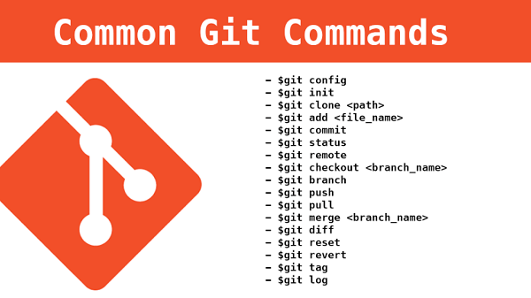
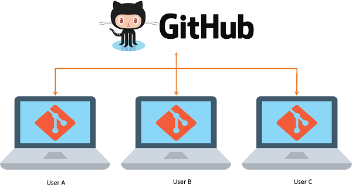

# Git和Github学习记录

[Git](https://git-scm.com/downloads)是Linux发明者Linus开发的一款新时代的版本控制系统，应用广泛。

[](https://git-scm.com/book/zh/v2)

GitHub是一个面向[开源](https://opensource.guide)及私有软件项目的托管平台，因为只支持Git作为唯一的版本库格式进行托管，故名GitHub。

[](https://github.com)

## GitHub入门

参考资料：
- [What is GitHub?](https://www.youtube.com/watch?v=w3jLJU7DT5E)
- [GitHub Courses](https://skills.github.com)
- [GitHub Docs](https://docs.github.com/zh/get-started)
- [GitHub Discussions](https://github.com/orgs/community/discussions)
- [真小白入门之Github](https://blog.csdn.net/nmjuzi/article/details/82184818)
- [GitHub Training Kit](https://training.github.com)
- [GitHub Cheat Sheet](https://training.github.com/downloads/zh_CN/github-git-cheat-sheet/)

### GitHub常见术语

- [Git术语表](https://mirrors.edge.kernel.org/pub/software/scm/git/docs/gitglossary.html)
- [GitHub术语表](https://docs.github.com/zh/get-started/quickstart/github-glossary)

GitHub基本概念：
- `Repository`：代码仓库
- `Issue`：其他人提出的问题(bug或改进意见)
- `Star`：获得其他人的点赞
- `Fork`：原项目的分支
- `Pull Request`：代码合并请求
- `Watch`：接收代码变更提醒
- `Gist`：代码片段

GitHub必备知识
- Markdown
    - [Markdown Guide](https://www.markdownguide.org)
    - [markdown-syntax](https://github.com/cdoco/markdown-syntax)
- Git
    - [Pro Git 英文版](https://git-scm.com/book/en/v2)
    - [Pro Git 中文版](https://git-scm.com/book/zh/v2)
- LICENSE
    - [Open Source LICENSE](https://opensource.org/licenses)
    - [Choose a LICENSE](https://choosealicense.com)

### GitHub工具

- GitHub CLI
    - [GitHub CLI Source Code](https://github.com/cli/cli)
    - [GitHub CLI Command Manual](https://cli.github.com/manual/)
- GitHub Destop
    - [GitHub Destop Download](https://desktop.github.com)

### GitHub操作

- [创建Repository](https://docs.github.com/zh/get-started/quickstart/create-a-repo)
    - 说明：个人不建议直接创建README.md、.gitignore等文件，建议自行创建后本地commit
- [Fork已有Repository](https://docs.github.com/zh/get-started/quickstart/fork-a-repo)
- [参与开源项目贡献](https://docs.github.com/zh/get-started/quickstart/contributing-to-projects)
- [GitHub社交活动](https://docs.github.com/zh/get-started/quickstart/be-social)
    - [GitHub同名项目实现丰富多彩的README.md](https://blankspace.blog.csdn.net/article/details/122807529)

### 命令行提交

[Git提交代码到GitHub的基本操作流程](https://blankspace.blog.csdn.net/article/details/104073562)

执行命令：
1. `git add .`
2. `git pull origin master`
3. `git commit -m "注释"`
4. `git push -u origin master`

### JetBrains工具提交

解决方案：
- [IDEA项目关联Git的解决方案](https://blankspace.blog.csdn.net/article/details/105802880)
- [PyCharm项目关联Git的解决方案](https://blankspace.blog.csdn.net/article/details/106093626)

操作流程：
1. VCS → Import into Version Control → Create Git Repository...
2. 选定项目目录点右键 → Git
    1. Repository → Remotes... → + → 添加URL → ...
    2. Add
    2. Commit → Commit Message内容 → Commit按钮
    3. Repository → Push... → Push按钮

## Git常见基础问题

### Windows本地看不到.git

`.git`文件夹是隐藏文件夹，必须设置一下查看隐含文件夹才能看得到。

### DownloadZip和Clone的区别

1. DownloadZip通过浏览器下载zip压缩包，而clone通过GitBash下载
2. DownloadZip获得的源码不含.git，而clone下来的含.git

### Windows创建.gitignore文件

Windows创建`.gitignore`之类的文件可能报错，命名文件时直接命名为`.gitignore.`即可解决问题。GitHub给出了部分[`.gitignore模板`](https://github.com/github/gitignore)

## 解决本地历史和远端仓库历史不一致

通常，比如我们新建一个Github的Repository(带README.md)，本地直接提交就会被`rejected`……<br/>
这种情况其实也蛮常见的，这就是我上面写到的“暴力提交三步走”的弊端——没考虑本地Git和远端Github的兼容。<br/>
此时，`git pull origin master --allow-unrelated-histories`命令就显得很香，可以解决此问题，基本屡试不爽！

当然，也可以另外clone一份，人工操作重新提交和推送。

## Git配置

### 配置文件存放位置

- `/etc/gitconfig`
- `~/.gitconfig` 或 `~/.config/git/config`
- `.git/config`

### 添加修改配置信息

- 配置用户名：`git config --global user.name <username>`
- 配置邮箱：`git config --global user.email <your_email_address>`
- 配置http代理：`git config --global http.proxy http://127.0.0.1:7079`
- 配置https代理：`git config --global https.proxy https://127.0.0.1:7079`
- 配置远程存储库URL：`git remote add origin <repo_url>`

### 查看配置

- 查看所有的配置以及它们所在的文件：`git config --list --show-origin`
- 查看远程存储库URL：`git remote -v`

### 取消配置

- 取消配置http代理：`git config --global --unset http.proxy`
- 取消配置https代理：`git config --global --unset https.proxy`

### 配置文件

[Git文件.gitignore、.gitattributes、.gitkeep用法解析](https://juejin.cn/post/7081941648401235976)

## Git获取帮助

- 命令行帮助
    - `git help <verb>`
    - `git <verb> --help`
    - `man git-<verb>`：UNIX/Linux环境
    - `git <verb> -h`：查阅简单说明
- 查阅官方文档
    - [Pro Git 英文版](https://git-scm.com/book/en/v2)
    - [Pro Git 中文版](https://git-scm.com/book/zh/v2)

## Git获取仓库

- 新建Git目录：`git init`
- 克隆Git目录：`git clone <url>`


## 查看提交日志

`git log`能打印出你在这个Git目录下的commit记录。

如果是Git目录，则可以查看Log；如果不是Git目录，则不可以查看Log。

## 查看状态
查看当前仓库的状态可以用`git status`这个命令，有时候不知道进行到哪一步的话这个命令挺有用的。<br/>
大家可以在提交的每一步进行后使用这个命令看一看仓库状态。

## 分支与合并
说实话，直到写这部分，我还没怎么用过分支与合并，所有的项目基本都是自己来处理，那顺便学一下吧！<br/>
本地做个测试即可，首先需要创建一个本地仓库，我新建一个`git_test`文件夹，在此目录下使用`git init`命令可使git_test文件夹含.git文件夹。<br/>
注意此时新建项目的不能直接新建分支，否则会报错：`fatal: Not a valid object name: 'master'.`，也就是说必须先commit至少一次才行。<br/>
先随便放一个文件进去，再依次输入`git add .`、`git commit -m "测试"`，完成初次提交。<br/>
接下来新建分支`a_test`，命令为`git branch a_test`。<br/>
使用命令`git branch`可查看分支情况：
```text
  a_test
* master
```
`master`表示主干，`a_test`则是新建的分支，`\*`表示当前分支<br/>
使用命令`git checkout a_test`即可切换到a_test分支目录下：
```text
* a_test
  master
```
回到主分支，使用命令`git checkout -b b_test`可以新建b_test分支并切换过去：
```text
  a_test
* b_test
  master
```
接下来我们该测试合并分支了，切回master，使用命令`git merge a_test`，如果无冲突则直接合并成功：<br/>
```text
Already up to date.
```
删除分支要分情况：
- 分支与主干是同步的(如分支建错、已提交同步等)需要删除：`git branch -d a_test`
- 分支与主干是不同步的但需要强行删除：`git branch -D b_test`

## 给代码打上版本Tag
我们给初代版本打上Tag，表示版本为V1.0：`git tag v1.0`。
随着修改，我们提交后给新版本打上V1.1的Tag：`git tag v1.1`
如若需要回溯到V1.0版本，需使用命令`git checkout v1.0`：
```text
git checkout v1.0
Note: switching to 'v1.0'.

You are in 'detached HEAD' state. You can look around, make experimental
changes and commit them, and you can discard any commits you make in this
state without impacting any branches by switching back to a branch.

If you want to create a new branch to retain commits you create, you may
do so (now or later) by using -c with the switch command. Example:

  git switch -c <new-branch-name>

Or undo this operation with:

  git switch -

Turn off this advice by setting config variable advice.detachedHead to false

HEAD is now at 025ee41 测试

```
我们查看log，没有V1.1的log：
```text
git log
commit ......... (HEAD, tag: v1.0)
Author: ... <...@users.noreply.github.com>
Date:   Mon Jul 27 18:36:08 2020 +0800

    测试

```
然后我们返回至V1.1(`git checkout v1.1`)：
```text
git log
commit ......... (HEAD, tag: v1.1, master)
Author: ... <...@users.noreply.github.com>
Date:   Mon Jul 27 18:36:38 2020 +0800

    测试

commit ......... (tag: v1.0)
Author: ... <...@users.noreply.github.com>
Date:   Mon Jul 27 18:36:08 2020 +0800

    测试

```

## 查看当前项目所有的远程仓库
```text
git remote -v
```
如果没有远程仓库，则不会有输出。<br/>
如果有单一远程仓库，则显示如下内容：
```text
origin https://github.com/username/repository_name (fetch)
origin https://github.com/username/repository_name (push)
```

## 指定远程仓库的用户名和邮箱
比较一劳永逸的做法是指定全局的默认用户名和邮箱：
```text
git config --global user.name "username"
git config --global user.email "email_address"
```
我们也可以为专属的项目设置默认用户名和邮箱，只需去掉`--global`即可：
```text
git config user.name "username"
git config user.email "email_address"
```

## 配置相关
`git config -l`命令可查配置信息，这个配置文件的位置是Linux的`~/.gitconfig`

一些比较经典的配置如下(配置用户名、邮箱这种上面提过了)：
- `git config --global core.editor "vim" # 设置Editor使用vim`
- `git config --global color.ui true # 开启终端的各种颜色`
- `git config --global core.quotepath false #设置显示中文文件名`

## checkout再说明
checkout两个主要功能：
- 切换分支branch
- 切换版本标签tag

## 查看版本改动
查看版本改动需要使用`git diff`命令：
```text
git diff <$id1> <$id2> # 比较两次提交之间的差异
git diff <branch1>..<branch2> # 在两个分支之间比较
git diff --staged # 比较暂存区和版本库差异
```
直接输入git diff只能比较当前文件和暂存区文件(仍未执行git add的文件)差异。<br/>
- 查到的改动如果是 **红色的"-"** 则代表删除的内容。
- 查到的改动如果是 **绿色的"+"** 则代表增加的内容。

## stash的使用
`git stash`命令可以把当前分支所有没有commit的代码先暂存起来，此时使用`git status`查看仓库状态是很干净的。<br/>
而输入`git stash list`可查到一条暂存记录。<br/>
将暂存记录的还原到原分支中使用的命令是`git stash apply`，还原后使用命令`git stash drop`删掉这条暂存记录。<br/>
`git stash pop`会帮我们还原+删除stash记录。<br/>
另说，drop只删一条stash记录，而`git stash clear`删的是所有stash记录。

## 分支冲突
我们在开发的过程中一般都会约定尽量大家写的代码不要彼此影响，以减少出现冲突的可能，但是冲突总归无法避免的，我们需要了解并掌握解决冲突的方法。<br/>
冲突的地方由`====`分出了上下两个部分，上部分一个叫HEAD的字样代表是当前所在分支的代码，下半部分是另一个分支的代码。<br/>
对比很明显，所以我们很容易判断哪些代码该保留，哪些代码该删除。我们只需要移除掉那些老旧代码，而且同时也要把那些`\<\<\<HEAD`、`====`以及`\>\>\>\>\>\>`这些标记符号也一并删除，最后进行一次commit就ok了。

## 新Repository的README.md
Github、Gitee这些仓库在New一个Repository时都会有新建README.md的选项，而README.md一般是不能缺的，所以开始的时候我都会直接顺手创建。<br/>
但是后来就出现了很多很多的麻烦，所以现在个人不建议直接创建README.md这东西，本地自己创一个文件写好内容直接push就行。

## 从Github撤销一次提交
```text
git reset --hard HEAD~
git push -f
```

## 强行push到远程仓库
```shell
git push -f origin master
```

## RPC failed
Git提交Github报错：`RPC failed; curl 56 OpenSSL SSL_read: SSL_ERROR_SYSCALL, errfno 10054`

输入`git config http.sslVerify "false"`即可。
